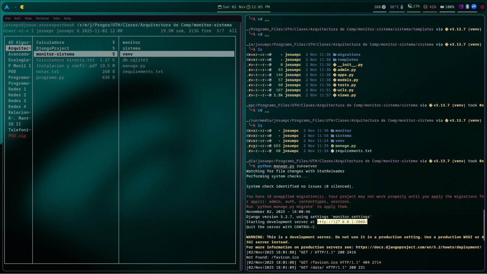
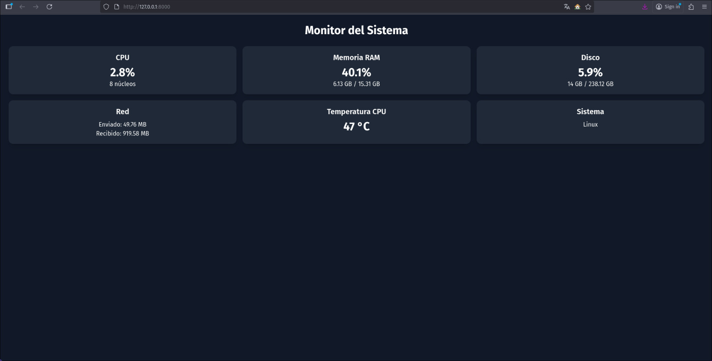
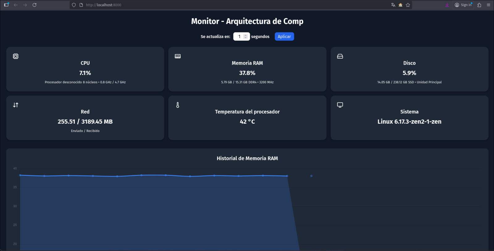

# 🖥️ Monitor del Sistema - Arquitectura de Computadoras

Este proyecto es un **monitor de sistema desarrollado en Django**, diseñado para mostrar en tiempo real estadísticas del equipo, como uso de CPU, memoria RAM, disco, red y temperatura del procesador.  
Fue creado como parte del **examen práctico de la clase Arquitectura de Computadoras para el segundo parcial**.

---

## 🚀 Características principales

- Visualización **en tiempo real** del estado del sistema
- Intervalo de actualización configurable manualmente (por defecto 5 segundos)
- Interfaz web moderna y minimalista desarrollada con **HTML + CSS + Tailwind**
- Recolección de datos del sistema mediante la librería **psutil**
- Información presentada en tarjetas con valores dinámicos

---

## 🧩 Estructura del proyecto
```bash
monitor-sistema/
│
├── monitor/
├── sistema/
│ ├── templates/
│ ├── views.py
│ ├── urls.py
│ └── models.py
│
├── manage.py
├── requirements.txt
└── README.md
```

---

## ⚙️ Instalación y ejecución local

### 1️⃣ Clonar el repositorio

```bash
git clone https://github.com/JosueDJ20212015/sistema-monitor-ECC-Examen-Arqu.Comp.git
cd sistema-monitor-ECC-Examen-Arqu.Comp
```

### 2️⃣ Crear y activar el entorno virtual
```bash
python -m venv venv
venv\Scripts\activate
```

### 3️⃣ Instalar dependencias
```bash
pip install -r requirements.txt
```

### ▶️ Ejecutar el servidor
```bash
python manage.py runserver
```

Luego abre tu navegador y visita:
```bash
http://127.0.0.1:8000/
```


## 🧠 Explicación de los componentes

🧩 views.py

Contiene la lógica principal.
Utiliza la librería psutil para obtener los siguientes datos:
- Porcentaje de uso de CPU, RAM y disco.
- Velocidad y núcleos del procesador.
- Datos de red enviados/recibidos.
- Temperatura del CPU (cuando está disponible).
Estos datos se envían al template en forma de diccionario para ser renderizados dinámicamente.

🎨 templates/sistema/index.html

Es la interfaz web del monitor.
Muestra las métricas del sistema en tarjetas con íconos y un diseño oscuro moderno.
Incluye un selector para ajustar el intervalo de actualización en segundos mediante JavaScript.

🌐 urls.py
Define las rutas del proyecto, conectando la vista principal (index) con la URL raíz del sistema.


## 🧑‍💻 Autores
* Emer Romero
* Cristhian Espinoza
* Cristhian Calderiny

# 🖼️ Screenshots



